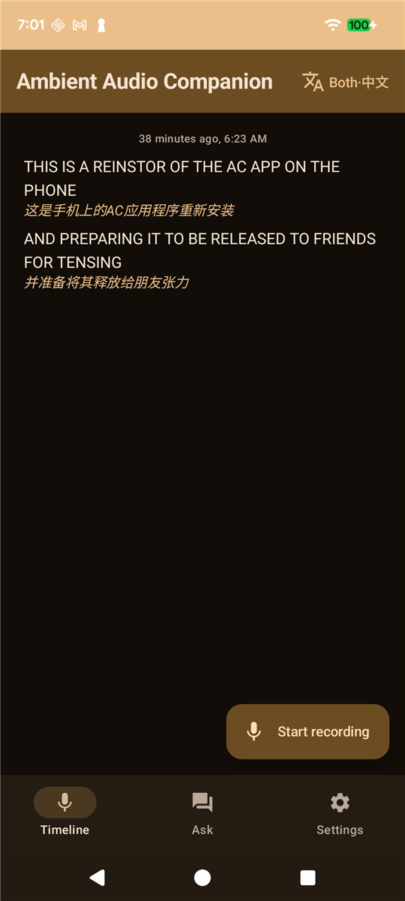

# AAC 安装指引 / Install Guide

> **Ambient Audio Companion (AAC)** — 全天候端侧录音 + 离线转写/翻译的 Android App。
> An all-day, on-device audio recorder with offline speech-to-text & translation for Android.
>
> 当前版本 / Current build: **v0.4.5** · 仅支持 64 位 ARM 手机 (arm64-v8a) / 64-bit ARM phones only · Android 10+

---

## 🇨🇳 中文

### 一、扫码下载(最省事)
用**手机相机**对准下面的二维码,点弹出的链接即可直接下载安装包(约 96MB):

> 扫码下载的是 **release 版**(推荐朋友日常使用)。

### 二、或点链接下载
- **推荐 · release 版**(约 96MB):
  https://github.com/jetzhu/aac-models/releases/download/app-v0.4.5/aac-v0.4.5.apk
- **排错 · debug 版**(约 112MB,日志更全;遇到问题时再装这个抓日志):
  https://github.com/jetzhu/aac-models/releases/download/app-v0.4.5/aac-v0.4.5-debug.apk

> release 与 debug 是**两个独立 App**,可以同时装,互不影响。平时用 release;出问题再装 debug 给我发日志。

### 三、安装(首次会提示"未知来源")
1. 点开下载好的 `.apk` 文件。
2. 系统弹"为了您的安全,手机不允许安装来自此来源的未知应用" → 点 **设置** → 打开 **允许来自此来源** → 返回 → **安装**。
3. 安装完成,打开 App。

### 四、首次启动
1. 阅读并**同意**使用须知(两个勾都要勾上,"同意"按钮才能点)。
2. 授予**麦克风**权限。
3. 接到 **Wi-Fi** 后,App 会**自动后台下载模型**(转写 sherpa ~168MB + 标点 ~281MB + 翻译 ML Kit ~60MB)。请保持 Wi-Fi,首次约需几分钟;**计费流量下不会自动下载**。
4. 下载完即可开始录音转写。界面如下(右上角可切换"原文 / 译文 / 双语"显示):

### 常见问题
- **必须连 Wi-Fi 吗?** 首次需要(下模型)。模型下好后,转写/翻译全部在手机本地完成,**离线可用**。
- **看到"Android App Compatibility / 16KB"警告?** 只有 **debug 版**会弹,点 "Don't Show Again" 即可,不影响使用;release 版不会出现。
- **录音会上传吗?** 默认不会。录音、转写、翻译都在本机;只有你主动用"问答"功能时才会把选中的文字发给云端 LLM。
- **怎么后台长时间录?** App 用前台服务常驻;建议在系统里给它**关闭电池优化 / 允许后台活动**。

---

## 🇬🇧 English

### 1. Scan to download (easiest)
Point your **phone camera** at the QR code below and tap the link to download the installer (~97MB):

> The QR points to the **release** build (recommended for everyday use).

### 2. Or download via link
- **Recommended · release** (~97MB):
  https://github.com/jetzhu/aac-models/releases/download/app-v0.4.5/aac-v0.4.5.apk
- **Troubleshooting · debug** (~112MB, verbose logs — install this only if something breaks):
  https://github.com/jetzhu/aac-models/releases/download/app-v0.4.5/aac-v0.4.5-debug.apk

> release and debug are **two separate apps** and can coexist. Use release normally; install debug to capture logs if you hit an issue.

### 3. Install (you'll be prompted about "unknown sources")
1. Open the downloaded `.apk`.
2. Android says it won't install apps from this source → tap **Settings** → enable **Allow from this source** → go **back** → **Install**.
3. Open the app once installed.

### 4. First launch
1. Read and **accept** the consent notice (tick both boxes to enable the Accept button).
2. Grant the **microphone** permission.
3. On **Wi-Fi**, the app **auto-downloads its models in the background** (sherpa STT ~168MB + punctuation ~281MB + ML Kit translation ~60MB). Keep Wi-Fi on; the first download takes a few minutes. **It will not download over metered/cellular data.**
4. Once done, start recording. The timeline looks like this (top-right toggles Original / Translated / Bilingual display):

### FAQ
- **Do I need Wi-Fi?** Only for the first run (to fetch models). After that, transcription & translation run **fully on-device, offline**.
- **"Android App Compatibility / 16KB" warning?** Only the **debug** build shows it — tap "Don't Show Again"; it's harmless. The release build never shows it.
- **Are my recordings uploaded?** No, by default. Recording, transcription and translation stay on the phone. Only the "Ask" feature sends the text you choose to a cloud LLM.
- **How do I record in the background for a long time?** The app runs a foreground service; for best results **disable battery optimization / allow background activity** for it in system settings.
